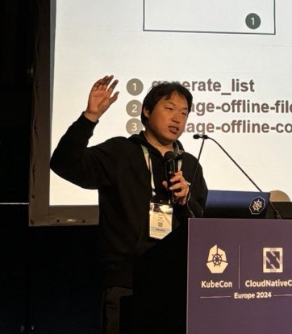
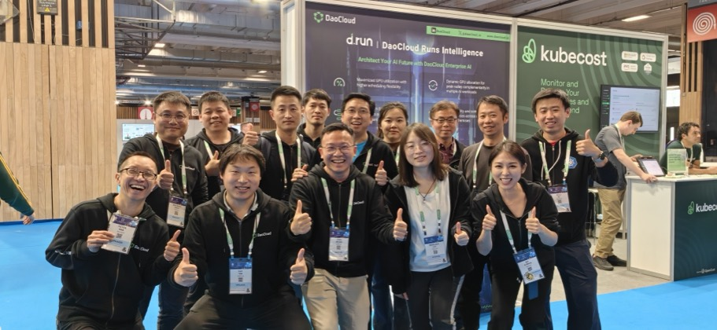

## Hi 👋 I am Kay Yan (颜开)

If you are interested in me, please email me:  📫 yankaycom@gmail.com. 

⚡ Fun fact: **Cloud Native**    

🔭 I’m currently working on [DaoCloud](https://www.daocloud.io/en/), ex [EMC](https://en.wikipedia.org/wiki/Dell_EMC), ex [Nanjing University](https://en.wikipedia.org/wiki/Nanjing_University)

😄 [Kubespray](https://github.com/kubernetes-sigs/kubespray), [Containerd/Nerdctl](https://github.com/containerd/nerdctl) Maintainer

🌱 Learning and Sharing

* [2024 KubeCon Europe - How to Deploy an AI-Optimized K8s Cluster with Kubespray - Kay Yan, DaoCloud & Mohamed Zaian, New Work SE](https://kccnceu2024.sched.com/event/1YhhP/how-to-deploy-an-ai-optimized-k8s-cluster-with-kubespray-kay-yan-daocloud-mohamed-zaian-new-work-se)
* [2023 KubeCon China - SIG Cluster Lifecycle: What's New in Kubespray - Kay Yan, DaoCloud](https://kccncosschn2023.sched.com/event/1PTJt/sigzhong-shi-chang-potodaepkubesprayzha-xia-sig-cluster-lifecycle-whats-new-in-kubespray-kay-yan-daocloud)

🏆 Honors：

* [2023 "Top Ten Outstanding Software Engineers" - China Electronic Information Industry Federation](https://baijiahao.baidu.com/s?id=1776345995076640356&wfr=spider&for=pc)
* [2019 Forbes List of China’s 30 elites under 30 years old - Forbes China](https://www.forbeschina.com/lists/1725)
* 2012 EMC Global Innovation Showcase CTO Award
* 2007 Top 10 in [ACM/ICPC](https://en.wikipedia.org/wiki/International_Collegiate_Programming_Contest) Asian Regional Competition Nanjing Division

📷 Photo:

