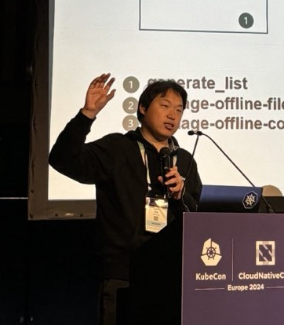
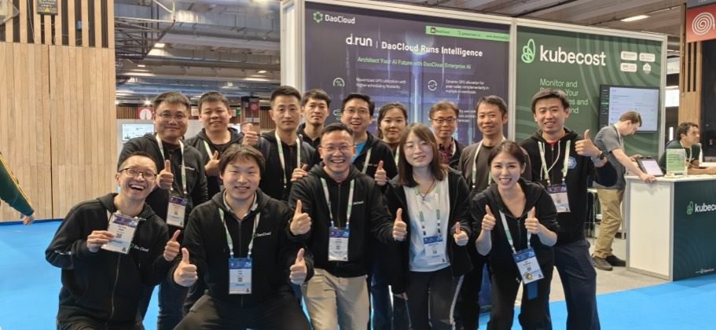

## Hi 👋 I am Kay Yan (颜开)

If you are interested in me, please email me:  📫 yankaycom@gmail.com. 

⚡ Fun fact: **Cloud Native**, **AI/LLM**  

🔭 I’m currently working on [DaoCloud](https://www.daocloud.io/en/), ex [EMC](https://en.wikipedia.org/wiki/Dell_EMC), ex [Nanjing University](https://en.wikipedia.org/wiki/Nanjing_University)

😄 Maintainer/contributor across selected projects including [Kubespray](https://github.com/kubernetes-sigs/kubespray), [nerdctl](https://github.com/containerd/nerdctl), [K8sGPT](https://github.com/k8sgpt-ai/k8sgpt), [llm-d](https://github.com/llm-d), [Kubean](https://github.com/kubean-io/kubean), [Spiderpool](https://github.com/spidernet-io/spiderpool), [MatrixHub](https://github.com/matrixhub-ai/matrixhub), and [ClawWork](https://github.com/clawwork-ai/ClawWork)

🌱 Learning and Sharing

Recent Highlights:
- **2026 KubeCon EU**: [Tutorial: KV-Cache Wins You Can Feel: Building AI-Aware LLM Routing on Kubernetes](https://kccnceu2026.sched.com/event/2CW5y/tutorial-kv-cache-wins-you-can-feel-building-ai-aware-llm-routing-on-kubernetes-tyler-michael-smith-red-hat-kay-yan-daocloud-vita-bortnikov-michal-malka-maroon-ayoub-ibm)
- **2025 KubeCon Japan**: [Sailing Multi-host Inference for LLM on Kubernetes](https://kccncjpn2025.sched.com/event/1x6zY/sailing-multi-host-inference-for-llm-on-kubernetes-kay-yan-daocloud)
- **2025 KubeCon China**: [AI-Powered Kubernetes Diagnostics With K8sGPT](https://kccncchn2025.sched.com/event/1x5iR/cl-lightning-talk-ai-powered-kubernetes-diagnostics-with-k8sgpt-kay-yan-daocloud)
- **2025 KubeCon China**: [Building Custom GPU Clusters at Scale][def]

See [more slides](slides/README.md)

🏆 Honors：

* [2023 "Top Ten Outstanding Software Engineers" - China Electronic Information Industry Federation](https://baijiahao.baidu.com/s?id=1776345995076640356&wfr=spider&for=pc)
* [2019 Forbes List of China’s 30 elites under 30 years old - Forbes China](https://www.forbeschina.com/lists/1725)
* 2012 EMC Global Innovation Showcase CTO Award
* 2007 Top 10 in [ACM/ICPC](https://en.wikipedia.org/wiki/International_Collegiate_Programming_Contest) Asian Regional Competition Nanjing Division

🛸 Badges：

📷 Photo:

[def]: https://kccncchn2025.sched.com/event/1x5hZ/building-custom-gpu-clusters-at-scale-using-kubespray-to-create-high-performance-ai-infrastructure-kay-yan-daocloud-rong-zhang-vivo
