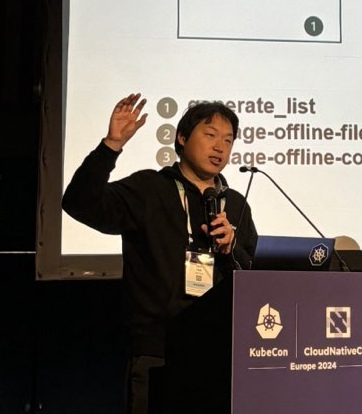
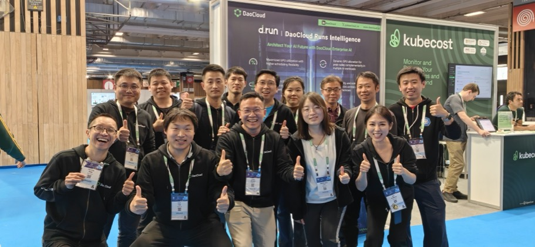

# Hi 👋 I am Kay Yan (颜开)

For collaboration or speaking inquiries, please email me:  📫 yankay.com@gmail.com.

⚡ Focus: **Cloud Native**, **AI/LLM**  

🔭 I’m currently working at [DaoCloud](https://www.daocloud.io/en/), ex [EMC](https://en.wikipedia.org/wiki/Dell_EMC), studied at [Nanjing University](https://en.wikipedia.org/wiki/Nanjing_University)

## Open Source

😄 Maintainer/contributor across selected projects including [Kubespray](https://github.com/kubernetes-sigs/kubespray), [llm-d](https://github.com/llm-d), [LWS](https://github.com/kubernetes-sigs/lws), [Spiderpool](https://github.com/spidernet-io/spiderpool), [Kubean](https://github.com/kubean-io/kubean), [ClawWork](https://github.com/clawwork-ai/ClawWork), [MatrixHub](https://github.com/matrixhub-ai/matrixhub), [nerdctl](https://github.com/containerd/nerdctl), and [K8sGPT](https://github.com/k8sgpt-ai/k8sgpt)

## 🌱 Learning and Sharing

- **2026 KubeCon China**: [Beyond Model Sharding: Atomic Scheduling and Disaggregated LLM Serving with LeaderWorkerSet](https://kubecon-cloudnativecon-openinfra-pytorch-2026.sessionize.com/session/1222146)
- **2026 KubeCon Japan**: [From Model Serving to Distributed Inference: How llm-d Evolves AI Platforms on Kubernetes](https://kubecon-cloudnativecon-japan-2026.sessionize.com/session/1194013)
- **2026 KubeCon EU**: [Tutorial: KV-Cache Wins You Can Feel: Building AI-Aware LLM Routing on Kubernetes](https://kccnceu2026.sched.com/event/2CW5y/tutorial-kv-cache-wins-you-can-feel-building-ai-aware-llm-routing-on-kubernetes-tyler-michael-smith-red-hat-kay-yan-daocloud-vita-bortnikov-michal-malka-maroon-ayoub-ibm)

[All talks and slides](slides/README.md)

## 🏆 Honors:

- [2023 "Top Ten Outstanding Software Engineers" - China Electronic Information Industry Federation](https://baijiahao.baidu.com/s?id=1776345995076640356&wfr=spider&for=pc)
- [2019 Forbes List of China’s 30 elites under 30 years old - Forbes China](https://www.forbeschina.com/lists/1725)
- 2012 EMC Global Innovation Showcase CTO Award
- 2007 Top 10 in [ACM/ICPC](https://en.wikipedia.org/wiki/International_Collegiate_Programming_Contest) Asian Regional Competition Nanjing Division

## Badges

### Speaking

### Community Contributions

### Certifications

## Photos

## GitHub Activity

Metrics and contributions

